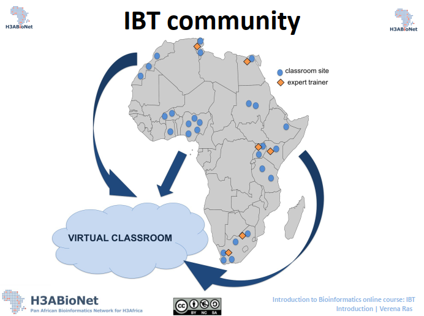
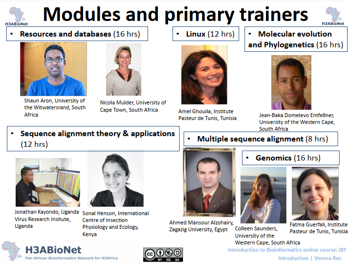

# Run Down of Session 1

## Aim of the course
* *To provide an introduction to bioinformatics - focus on bioinformatics tools
and resources*

* *To allow participants to gain knowledge and practical experience through theoretical
and practical sessions*

## The H3ABioNet IBT Community

It involves 32 institutions across 15 African countries developing bioinformatics 
capacity in Africa.

## Why IBT?
> need for basic bioinformatics training for individuals entering the discipline, or for

> those who need a basic foundational understanding before moving on to more complex areas

*H3ABioNet Education & Training Working Group*

## Modules and Primary Trainers
---

